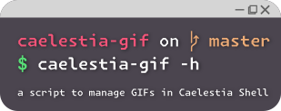

# Caelestia GIF Manager (`caelestia-gif`)



A terminal user interface (TUI) written in C for managing GIFs (sessionGif and mediaGif) in the Caelestia shell environment.


---

## Introduction
Caelestia GIF Manager is a lightweight TUI tool designed to easily browse, preview and set GIFs for your Caelestia Shell session menu and media player. It supports thumbnail generation (via ImageMagick) and displays live previews directly in the Kitty terminal emulator. Use the `session` subcommand to select a session GIF, and the `media` subcommand to select a media GIF.

## Installation
### Commands
There are multiple ways to install Caelestia GIF Manager:

1. From AUR (on Arch Linux):
```bash
yay -S caelestia-gif
caelestia-gif --init
# or
paru -S caelestia-gif
caelestia-gif --init
```

2. With the built-in Bash install script:
   - Using a single command (`curl` + `sh`):
      ```bash
      curl -sSL https://raw.githubusercontent.com/gnoooo/caelestia-gif/refs/heads/master/install.sh | sudo sh
      ```

3. From source (manual compilation):
```bash
git clone git@github.com:gnoooo/caelestia-gif.git
cd caelestia-gif
make
sudo make install
caelestia-gif --init
```

### What is `install.sh`?
The repository contains an `install.sh` file, a simple Bash script that automates the installation of Caelestia GIF Manager. It will:
- Clone the repository from GitHub
- Compile the source code using `make`
- Install the compiled binary to `/usr/local/bin/` using the `install` command
- Run `caelestia-gif --init` to set up the necessary configuration and directories


## Usage
```bash
caelestia-gif [-h] [-v] [--init] [subcommand] [flags]
```

Where `[subcommand]` can be:
| Subcommand | Description |
|------------|-------------|
| `session`  | Opens the TUI to select and apply a session GIF. |
| `media`    | Opens the TUI to select and apply a media GIF. |
| `cli`      | Command-line interface to set a GIF without TUI. (NOT IMPLEMENTED YET) |

Available flags (for `session` and `media` subcommands):
| Flag | Description |
|------|-------------|
| `-h`, `--help` | Show help for the command or subcommand. |
| `-v`, `--version` | Print the current version. |
| `--init` | Run post-installation setup. |
| `-r`, `--regenerate` | Regenerate all thumbnails. |
| `-k`, `--no-kitty` | Disable Kitty Graphics Protocol for previews. |
| `--verbose` | Enable verbose output. |

### Example
```bash
caelestia-gif session
caelestia-gif media -r
```
In the TUI:
- `↑` / `↓`: navigate the list
- `Enter`: select and apply the GIF
- `o`: open the selected GIF with the default application
- `q` or `Ctrl+C`: exit without applying

## Configuration
### Post-installation setup
Run `caelestia-gif --init` after installation. This command:
- Creates the default GIF directory (`~/Pictures/CaelestiaGifs/`) if it doesn't exist.
- Creates `sessionGif/` and `mediaGif/` subdirectories.
- Backs up `~/.config/caelestia/shell.json` → `shell.bak.json` (skipped if backup already exists).
- Creates or updates `shell.json` so the `sessionGif` path points to your current GIF:
  ```
  ~/Pictures/CaelestiaGifs/.current/session.gif
  ```

### Environment Variables
You can override the default directories using environment variables:

| Variable | Default | Description |
|----------|---------|-------------|
| `CAELESTIA_GIFS_FOLDER` | `~/Pictures/CaelestiaGifs` | Base directory for all GIF subdirectories. |
| `CAELESTIA_THUMB_DIR` | `~/.cache/caelestia_gifs_thumb` | Directory for generated thumbnail cache. |

Example:
```bash
export CAELESTIA_GIFS_FOLDER=/mnt/data/MyGifs
export CAELESTIA_THUMB_DIR=/tmp/caelestia_thumbs
caelestia-gif session
```

## Dependencies
- `imagemagick`: thumbnail generation
- `kitty`: GIF preview via Kitty Graphics Protocol (optional but recommended)
- `cjson`: JSON parsing for `--init`
- `bash`

Build dependencies:
- `gcc`, `make`, `base-devel`

Install all on Arch Linux:
```bash
sudo pacman -S imagemagick kitty cjson bash gcc make base-devel --needed
```

## Default directory structure
```
~/
├── Pictures/
│   └── CaelestiaGifs/
│       ├── sessionGif/
│       │   └── [your_session_gifs]
│       ├── mediaGif/
│       │   └── [your_media_gifs]
│       └── .current/
│           ├── session.gif
│           └── media.gif
│
└── .cache/
    └── caelestia_gifs_thumb/
        ├── sessionGif/
        └── mediaGif/
```

Thumbnail images are generated only when a new GIF is added or `--regenerate` is used.

## Uninstallation
Via AUR helper:
```bash
yay -R caelestia-gif
```

Via the uninstall script:
```bash
curl -sSL https://raw.githubusercontent.com/gnoooo/caelestia-gif/refs/heads/master/uninstall.sh | sh
```

Via Makefile (if built from source):
```bash
cd caelestia-gif
sudo make uninstall
```

Manual removal:
```bash
sudo rm /usr/bin/caelestia-gif
sudo rm /usr/share/doc/caelestia-gif/README.md
sudo rm -r /usr/share/licences/caelestia-gif/LICENSE
```

---

## Licence
Licensed under the GPL-3.0-or-later License. See the [LICENSE](LICENSE) file for more details.

---

## Incoming
- Command-line interface (`caelestia-gif cli` subcommand)
- Improved installation script
- Use a symlink in `.current/` instead of copying the GIF file

